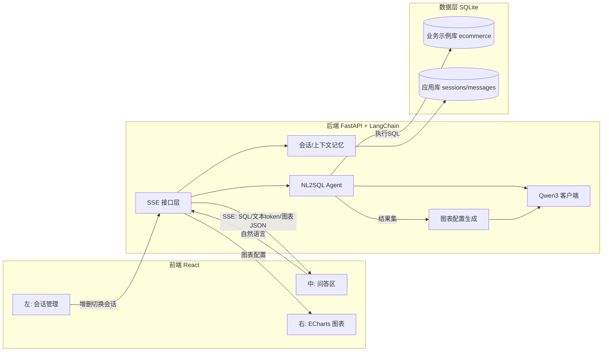
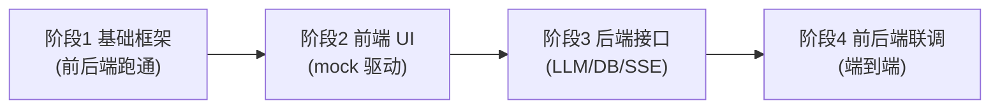

## 系统模块规划：智能数据分析系统

当前 `104-105/` 目录为空（仅有图片与 excalidraw 文件），整个系统从零搭建。

### 1. 总体架构与数据流

请求处理流水线：用户提问 → 加载会话上下文 → NL2SQL 生成并执行 SQL → 取结果集 → LLM 生成自然语言回答 + ECharts 配置 JSON → 通过 SSE 分阶段流式推送（SQL → 回答文本 token → 图表配置）→ 前端实时渲染问答与图表。

### 2. 后端模块（FastAPI + LangChain，Python）

建议目录 `104-105/backend/app/`：

- 配置模块 [backend/app/config.py](backend/app/config.py)：通过 `.env` 读取百炼 `DASHSCOPE_API_KEY`、模型名、`base_url`、数据库路径。
- 大模型接入模块 [backend/app/llm/client.py](backend/app/llm/client.py)：使用 `langchain-qwq` 的 **`ChatQwQ`** 接入百炼 Qwen3（已实测 `qwen3.7-max`）。
  - 配置从 `.env` 读取：`DASHSCOPE_API_KEY`、`LLM_MODEL`、`LLM_BASE_URL`（国内 `https://dashscope.aliyuncs.com/compatible-mode/v1`）。
  - **字段规范**见 [.cursor/rules/phase3-llm-io-spec.mdc](.cursor/rules/phase3-llm-io-spec.mdc)；实测脚本 [test_chat_qwq.py](data-analysis/backend/test_chat_qwq.py)、[test_nl2sql_agent_qwq.py](data-analysis/backend/test_nl2sql_agent_qwq.py)。
- 数据层
  - 业务数据库 [backend/app/db/database.py](backend/app/db/database.py)：SQLAlchemy 连接 SQLite，供 LangChain `SQLDatabase` 使用。
  - 种子脚本 [backend/app/db/seed.py](backend/app/db/seed.py)：创建示例电商/销售模型（如 `customers`、`products`、`orders`、`order_items`）并填充演示数据。
  - 应用存储 [backend/app/db/app_store.py](backend/app/db/app_store.py)：持久化 `sessions`、`messages` 表（会话管理 + 历史记忆）。
- NL2SQL 模块 [backend/app/agents/sql_agent.py](backend/app/agents/sql_agent.py)：基于 LangChain `create_agent` + 四个 SQL 工具（`sql_db_list_tables` / `sql_db_schema` / `sql_db_query` / `sql_db_query_checker`），结合表结构 schema 与会话上下文生成并执行 SQL（仅允许 SELECT，参数形状见 `phase3-llm-io-spec.mdc` §8）。
- 图表生成模块 [backend/app/agents/chart_agent.py](backend/app/agents/chart_agent.py)：将查询结果交给 LLM，由模型判断图表类型（柱/折/饼/表格）并输出 **ECharts option JSON**；用 Pydantic/输出解析器校验结构。
- 会话与上下文记忆 [backend/app/memory/history.py](backend/app/memory/history.py)：用 `RunnableWithMessageHistory` + SQLite 消息历史实现按 `session_id` 的上下文记忆（窗口截断控制 token）。
- API 接口层
  - 问答流式接口 [backend/app/api/chat.py](backend/app/api/chat.py)：`POST /api/chat` 返回 `text/event-stream`，分阶段推送事件 `sql` / `token`（回答文本）/ `chart`（ECharts 配置）/ `done`。
  - 会话管理接口 [backend/app/api/sessions.py](backend/app/api/sessions.py)：`GET/POST/DELETE /api/sessions`、`GET /api/sessions/{id}/messages`。
- 入口 [backend/app/main.py](backend/app/main.py)：FastAPI 实例、CORS、路由注册、启动时按需初始化示例库。
- 依赖与配置：[backend/requirements.txt](backend/requirements.txt)（fastapi, uvicorn, langchain, langchain-openai/community, sqlalchemy, sse-starlette, python-dotenv, pydantic）、[backend/.env.example](backend/.env.example)。

### 3. 前端模块（React + ECharts）

建议目录 `104-105/frontend/src/`（Vite + React + TypeScript）：

- 整体布局 [frontend/src/App.tsx](frontend/src/App.tsx)：三栏 Flex/Grid 布局——左侧会话、中间问答、右侧图表。
- 左栏 会话管理 [frontend/src/components/ChatSidebar.tsx](frontend/src/components/ChatSidebar.tsx)：会话列表、新建、切换、删除。
- 中栏 问答区 [frontend/src/components/ChatPanel.tsx](frontend/src/components/ChatPanel.tsx) + [frontend/src/components/MessageList.tsx](frontend/src/components/MessageList.tsx)：输入框、消息气泡、流式文本逐字渲染、可选展示生成的 SQL。
- 右栏 图表区 [frontend/src/components/ChartPanel.tsx](frontend/src/components/ChartPanel.tsx)：用 `echarts-for-react` 接收后端 ECharts option 实时渲染。
- 数据通信
  - SSE 客户端 [frontend/src/hooks/useChatStream.ts](frontend/src/hooks/useChatStream.ts)：消费 SSE 事件流，分别更新文本与图表状态。
  - API 封装 [frontend/src/api/client.ts](frontend/src/api/client.ts)：会话 CRUD 等 REST 调用。
- 状态管理 [frontend/src/store/sessions.ts](frontend/src/store/sessions.ts)：当前会话、消息、图表配置（Zustand 或 Context）。
- 工程文件：[frontend/package.json](frontend/package.json)、[frontend/vite.config.ts](frontend/vite.config.ts)（代理 `/api` 到后端）。

### 4. 关键技术决策

- LLM 接入：`langchain-qwq.ChatQwQ` + 国内百炼端点；流式/SSE/函数调用字段规范见 `phase3-llm-io-spec.mdc`。
- NL2SQL：`create_agent` + SQL Tools；`tool_calls[].args.query` 为 SQL 文本；`sql_db_query` 返回 `{columns, rows, row_count}`；详见 `phase3-llm-io-spec.mdc` §8。
- 图表：由 LLM 输出标准 ECharts option JSON，前端直接 `setOption`，零额外转换。
- 实时性：后端 `sse-starlette` 流式推送，前端按事件类型分流渲染。
- 数据隔离：业务数据库与应用元数据（会话/消息）分库，互不污染。

### 5. 分阶段研发计划

按照"先搭框架并测通 → 做前端 UI → 做后端接口 → 联调"的顺序推进，每个阶段都有明确的测试验收点。

#### 阶段 1：搭建前后端基础框架并运行测试
目标：前后端工程能各自独立启动并互通，不含业务逻辑。
- 后端：初始化 `backend/`，建 [backend/app/main.py](backend/app/main.py)、[backend/app/config.py](backend/app/config.py)、[backend/requirements.txt](backend/requirements.txt)、[backend/.env.example](backend/.env.example)；启用 CORS；提供探活接口 `GET /api/health`。
- 前端：用 Vite 初始化 `frontend/`（React + TS），建 [frontend/src/App.tsx](frontend/src/App.tsx) 三栏空布局占位，[frontend/vite.config.ts](frontend/vite.config.ts) 配置 `/api` 代理到后端。
- 测试验收：`uvicorn` 启动后端，访问 `/api/health` 与 `/docs` 正常；`npm run dev` 启动前端，页面可见三栏占位，前端能成功调用 `/api/health`。

#### 阶段 2：研发前端 UI（mock 数据驱动）
目标：在不依赖后端业务的情况下完成全部界面与交互。
- 三栏组件：[ChatSidebar.tsx](frontend/src/components/ChatSidebar.tsx)（会话列表/新建/切换/删除）、[ChatPanel.tsx](frontend/src/components/ChatPanel.tsx) + [MessageList.tsx](frontend/src/components/MessageList.tsx)（输入框、消息气泡、可展示 SQL）、[ChartPanel.tsx](frontend/src/components/ChartPanel.tsx)（`echarts-for-react` 渲染）。
- 状态与通信占位：[store/sessions.ts](frontend/src/store/sessions.ts) 管理会话/消息/图表状态；[api/client.ts](frontend/src/api/client.ts)、[hooks/useChatStream.ts](frontend/src/hooks/useChatStream.ts) 先返回 mock 数据（含一份示例 ECharts option）。
- 测试验收：用 mock 完成新建/切换/删除会话、发送消息看到（伪）流式文本、右侧渲染示例图表；样式与布局达标。

#### 阶段 3：研发后端接口
目标：实现全部业务能力并可独立测试。执行时**强制遵循** [.cursor/rules/phase3-llm-io-spec.mdc](.cursor/rules/phase3-llm-io-spec.mdc)。

- 数据层：[db/database.py](backend/app/db/database.py)、[db/seed.py](backend/app/db/seed.py)（示例电商库建表+种子数据）、[db/app_store.py](backend/app/db/app_store.py)（sessions/messages）。
- 模型与智能体：[llm/client.py](backend/app/llm/client.py)（`ChatQwQ`，配置读 `.env`）、[agents/sql_agent.py](backend/app/agents/sql_agent.py)（`create_agent` + §8 SQL 工具，仅 SELECT）、[agents/chart_agent.py](backend/app/agents/chart_agent.py)（生成并校验 ECharts option）。
- 记忆与接口：[memory/history.py](backend/app/memory/history.py)（按 session_id 上下文记忆，还原 `ToolMessage.tool_call_id`）、[api/sessions.py](backend/app/api/sessions.py)（会话 CRUD）、[api/chat.py](backend/app/api/chat.py)（`POST /api/chat` SSE）。

**LLM 字段与 SSE 映射（实测约定，不可偏离）：**

| 层 | 字段 | 阶段3用法 |
|---|---|---|
| 流式 chunk | `content` | SSE `token` 事件唯一来源（用户可见正文） |
| 流式 chunk | `additional_kwargs.reasoning_content` | 仅日志/调试，**不**推前端 |
| AIMessage | `tool_calls[].{name,args,id,type}` | SQL 工具入参；`sql_db_query.args.query` 为 SQL 文本 |
| ToolMessage | `content` + `tool_call_id` + `name` | `sql_db_query` 含 `{query, result:{columns,rows,row_count}}` |
| AIMessage | `response_metadata.finish_reason` | `tool_calls` 时必须走完工具往返再结束 SSE |
| SSE | `sql` / `result` / `token` / `chart` / `done` / `error` | `sql`←`args.query`；`result`←`sql_db_query` 结果集；见规范 §8.7 |

- 测试验收（**强制顺序**，详见规范 §9）：
  1. [test_chat_qwq.py](data-analysis/backend/test_chat_qwq.py) — LLM 字段
  2. [test_nl2sql_agent_qwq.py](data-analysis/backend/test_nl2sql_agent_qwq.py) — NL2SQL 参数
  3. 启动 `uvicorn`，确认 `/api/health` 为 `0.2.0`
  4. [test_api_phase3.py](data-analysis/backend/test_api_phase3.py) — 全接口集成（会话 CRUD、SSE 事件顺序、持久化、多轮记忆、错误用例）
  5. Swagger 辅助调试：http://localhost:8000/docs

#### 阶段 4：前后端联调
目标：去除 mock，打通真实端到端流程。
- 前端把 [api/client.ts](frontend/src/api/client.ts) 与 [hooks/useChatStream.ts](frontend/src/hooks/useChatStream.ts) 切到真实接口，消费真实 SSE 事件分别更新文本与图表。
- 联调重点：跨域/代理、SSE 断连与错误处理、流式逐字渲染、会话切换时上下文与图表正确刷新。
- 测试验收：端到端用例（如"按月统计销售额并画折线图""销量前 5 的商品柱状图"）能从提问到图表完整跑通；多轮对话上下文记忆正确。